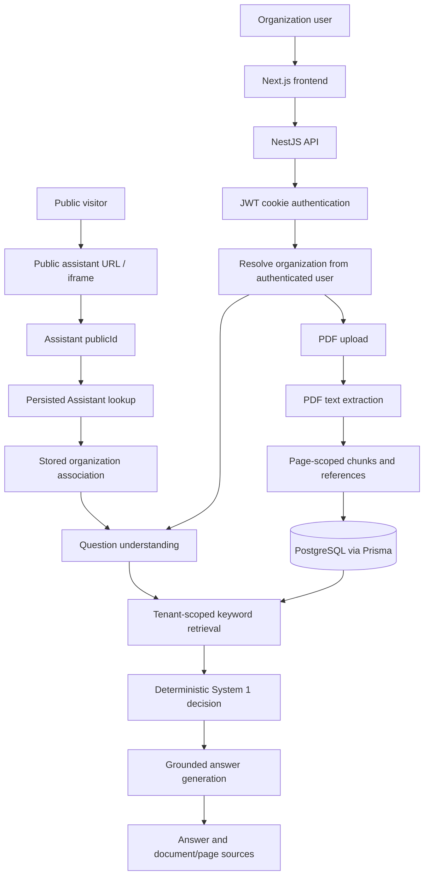

# Knowly — AI Knowledge & Decision Assistant

Knowly is a multi-tenant knowledge assistant for organizations. Teams can upload
PDF policies and reference material, then let authenticated users or visitors to
a public assistant ask questions answered from that organization's documents.
Answers include document and page sources.

## Problem and features

Organizations often keep important policies in PDFs that are difficult to
search and interpret. Knowly provides:

- Account registration and login, with an organization created for each new
  account.
- Organization-scoped PDF upload and document management.
- Page-level PDF text extraction and deterministic overlapping chunks.
- Keyword-based retrieval, question understanding, and a deterministic
  System 1 decision step.
- Grounded answer generation with backend-attached document/page references.
- A public assistant URL and an iframe-friendly embed page.
- Automated API integration tests for authenticated and public tenant isolation.

## Tech stack

- **Frontend:** Next.js App Router, React, TypeScript, Tailwind CSS
- **Backend:** NestJS, TypeScript
- **Data:** PostgreSQL and Prisma
- **LLM provider:** OpenAI-compatible Chat Completions API (`gpt-4o-mini` by
  default)
- **Package management:** npm workspaces

## Architecture



The authenticated tenant is derived server-side from the user identified by the
JWT. For public requests, the backend resolves the public ID through the
persisted Assistant record and uses its stored organization association.
Client-supplied `organizationId` is never used to choose a tenant. Document
chunks carry their organization ID explicitly, and retrieval filters by that
tenant.

## Authentication and tenant isolation

Registration creates a user and organization. Login and registration set a
short-lived, HttpOnly `knowly_session` JWT cookie. Protected controllers use the
authenticated user ID to resolve the user's organization; clients cannot switch
organizations by adding an organization ID to a request. Public assistant
identifiers are separate from admin authentication and do not grant access to
protected APIs.

## Document processing and references

1. An authenticated user uploads a PDF (maximum 10 MB); only PDF MIME types and
   PDF signatures are accepted.
2. The backend stores it under a server-generated name in `UPLOAD_DIR`, scoped
   to the authenticated organization.
3. Text is extracted page by page and persisted in `DocumentPage`.
4. Non-empty pages are split independently into approximately 1,000-character
   chunks with approximately 150 characters of overlap. Chunks retain their
   organization, document, page number, and page-local chunk index.
5. A document is marked `READY` only after processing and persistence succeed;
   processing failures mark it `FAILED`.

The MVP limits each organization to 10 PDFs and each PDF to 20 pages.
Processing is synchronous. Users can inspect their own document pages and
chunks; a guessed document ID from another organization is not sufficient to
access its data.

## Question and answer pipeline

- **Question understanding:** The LLM classifies and normalizes the question
  and proposes retrieval keywords. Its structured response is validated.
- **Retrieval:** Deterministic keyword matching searches only `READY` chunks in
  the resolved organization and returns up to five relevant chunks. This is
  not semantic or vector search.
- **System 1:** Deterministic application logic selects `ANSWER_FROM_KNOWLEDGE`,
  `NO_RELEVANT_KNOWLEDGE`, or `CLARIFICATION_REQUIRED`.
- **Answer generation:** Only retrieved tenant-scoped context is sent to the
  answer-generation model. Source metadata is attached from retrieval results,
  not invented by the model. No-knowledge and clarification responses do not
  invoke answer generation.

The LLM improves question understanding and response phrasing; it does not
choose the organization, retrieve across tenants, or make the structured
decision. These grounding controls are not formal claim-level verification.

## Public assistant and embed

An authenticated organization user can create or retrieve its single persisted
assistant. Its random public ID resolves to that assistant and its organization
on the backend. Public routes do not require a login and return an answer,
decision, and document/page sources without exposing organization IDs or
retrieval scores.

Embed flow:

```text
Public assistant → Embed URL → iframe → Visitor question
→ Public answer API → Tenant-scoped retrieval
→ Grounded answer → Sources
```

The public page is `/assistant/{publicId}`; the iframe page is
`/embed/assistant/{publicId}`. To embed an assistant, replace
`ASSISTANT_PUBLIC_ID` with the public ID returned by `POST /assistants`:

```html
<iframe
  src="http://localhost:3000/embed/assistant/ASSISTANT_PUBLIC_ID"
  width="100%"
  height="600"
  style="border:0;"
  title="Knowly Assistant">
</iframe>
```

No authentication is required for the public embed. The public ID maps to one
persisted assistant; visitors never supply an `organizationId`, and the
backend resolves the organization. Production deployments should configure
appropriate allowed embedding origins at the hosting/security-header layer.

## API summary

All endpoints are relative to the backend base URL (default
`http://localhost:4000`).

| Method | Path | Access | Purpose |
| --- | --- | --- | --- |
| `GET` | `/health` | Public | API liveness |
| `GET` | `/health/database` | Public | Database connectivity check |
| `POST` | `/auth/register` | Public | Create account and organization |
| `POST` | `/auth/login` | Public | Sign in and set session cookie |
| `POST` | `/auth/logout` | Public | Clear session cookie |
| `GET` | `/auth/me` | JWT | Get current account |
| `GET` | `/organization/me` | JWT | Get current organization and assistant |
| `GET` | `/organization/me/documents` | JWT | List current organization's documents |
| `POST` | `/assistants` | JWT | Get or create current organization's assistant |
| `POST` | `/documents` | JWT | Upload and process a PDF |
| `GET` | `/documents/:id/pages` | JWT | Read pages/chunks for an owned document |
| `POST` | `/documents/understand-question` | JWT | Inspect structured question understanding |
| `POST` | `/documents/search` | JWT | Search current organization's knowledge |
| `POST` | `/documents/decide` | JWT | Run decision and retrieval without final answer |
| `POST` | `/documents/answer` | JWT | Run the authenticated grounded-answer flow |
| `GET` | `/public/assistants/:publicId` | Public | Resolve public assistant information |
| `POST` | `/public/assistants/:publicId/answer` | Public | Ask the public assistant |

The backend global validation pipe rejects unknown request properties and
validates question input. Protected document and organization endpoints require
the JWT cookie; the public endpoints use only the public ID. See the
[`backend/requests/`](./backend/requests) examples for sample API requests.

## Environment variables

Copy the examples to local environment files and replace placeholders:

```powershell
Copy-Item backend\.env.example backend\.env
Copy-Item frontend\.env.example frontend\.env.local
```

| Variable | Used by | Purpose |
| --- | --- | --- |
| `DATABASE_URL` | Backend | PostgreSQL connection string |
| `PORT` | Backend | API port; defaults to `4000` |
| `JWT_SECRET` | Backend | Random signing secret; use at least 32 characters |
| `FRONTEND_URL` | Backend | Allowed frontend origin for credentialed CORS |
| `COOKIE_SAME_SITE` | Backend | `lax` locally; `none` for cross-site HTTPS |
| `UPLOAD_DIR` | Backend | Local PDF storage directory; defaults to `./uploads` |
| `LLM_API_KEY` | Backend | Provider API key; required for LLM-backed questions |
| `OPENAI_MODEL` | Backend | Optional model override; defaults to `gpt-4o-mini` |
| `PUBLIC_APP_URL` | Backend | Frontend base URL used to build public links |
| `NEXT_PUBLIC_API_URL` | Frontend | Backend base URL; local default `http://localhost:4000` |
| `NEXT_PUBLIC_APP_URL` | Frontend | Frontend base URL; local default `http://localhost:3000` |

Do not commit `.env` files or production credentials. The checked-in `.env.example`
files contain placeholders, not usable secrets. The tests mock provider calls
and do not need a live LLM API key.

## Local setup

Requirements: Node.js 20.16+ or 22.3+, npm, and PostgreSQL.

From the repository root:

```bash
npm install
```

Create a local PostgreSQL database (for example, `knowly`), configure
`backend/.env` and `frontend/.env.local` as above, then apply migrations and
generate the Prisma client:

```bash
npm run db:deploy --workspace backend
npm run db:generate --workspace backend
```

For local schema development when creating a new migration, use
`npm run db:migrate --workspace backend` instead of `db:deploy`.

Start the backend and frontend in separate terminals:

```bash
npm run dev:backend
npm run dev:frontend
```

Open [http://localhost:3000](http://localhost:3000). The API health check is
[http://localhost:4000/health](http://localhost:4000/health), and the database
check is [http://localhost:4000/health/database](http://localhost:4000/health/database).
Register at `/register` or sign in at `/login`.

## Demo data

With migrations applied, create or update the two deterministic demo tenants:

```bash
npm run seed:demo
```

The seed is safe to rerun. It creates distinct READY knowledge documents,
page-level chunks, and active assistants for:

| Organization | Demo login | Password |
| --- | --- | --- |
| Knowly Demo - Northstar Consulting | `demo@northstar.example` | `Knowly-Demo-2026!` |
| Knowly Demo - Apex University | `demo@apex.example` | `Knowly-Demo-2026!` |

These are local demo credentials only; do not use them in a deployed
environment. The Northstar employee handbook and Apex scholarship guide have
deliberately different content to make organization isolation easy to
demonstrate. Public assistant IDs are generated and stored in the database;
retrieve them through the authenticated dashboard/API rather than assuming a
fixed value.

## Tests, builds, and lint

The tenant integration tests use Node's built-in test runner and `tsx`; no
additional test framework is required. They require a reachable PostgreSQL
database, applied migrations, and `backend/.env`. The test suite creates and
removes isolated test organizations and mocks the external LLM API.

```bash
npm run test:tenant
npm run build
npm run lint --workspace frontend
```

Check Prisma configuration and migration state with:

```bash
npx prisma validate --schema backend/prisma/schema.prisma
npm run db:deploy --workspace backend
```

## Security considerations and limitations

- Tenant identity is derived server-side from the authenticated user or
  persisted public assistant. Never trust a client-provided organization ID.
- Public assistant IDs are random public identifiers, not credentials for
  administrative APIs. Public endpoint responses omit organization IDs and
  internal retrieval scores.
- JWTs are stored in HttpOnly cookies; use HTTPS and secure cookie settings in
  production. Configure CORS and allowed iframe origins for the deployment.
- Uploaded PDFs are stored locally in this MVP, and PDF processing is
  synchronous; production deployments should consider durable object storage
  and asynchronous processing.
- Retrieval is keyword-based; embeddings, vector search, and hybrid retrieval
  are not implemented.
- Grounding instructions and backend-attached sources do not provide formal
  claim-level answer verification.
- Production rate limiting and analytics are not implemented.
- Production deployment and production-scale behavior have not been tested.
- Live LLM-backed answers require a valid `LLM_API_KEY`; integration tests
  mock provider responses.

## Repository layout

```text
frontend/                 Next.js App Router application
backend/                  NestJS API and Prisma schema/migrations
backend/prisma/            Database schema and migrations
backend/scripts/           Demo data and PDF utility scripts
backend/test/              Tenant-isolation integration tests
```
